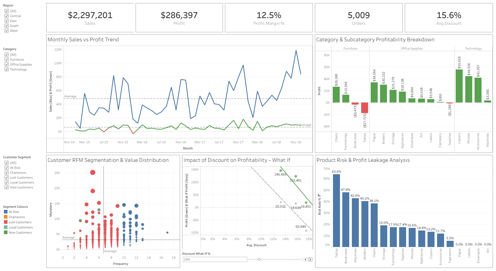

# Advanced Customer & Business Intelligence Analysis  
(Tableau • RFM Analytics • Scenario Modeling)

## 📌 Project Overview
This project delivers an advanced interactive business intelligence dashboard built in Tableau using the Superstore dataset. The focus of the analysis is to understand profitability trends, customer behavior, discount impact, and product risk.

The dashboard helps answer key business questions such as:

- How are sales and profits trending over time?
- Which categories and sub-categories drive profitability?
- How can customers be segmented using RFM analysis?
- What happens to profit when discounts increase?
- Which products carry the highest risk of profit leakage?

The project follows a structured analytics workflow:

Raw Data → Calculated Fields → RFM Segmentation → What-If Modeling → Interactive Tableau Dashboard

---

## 🛠 Tech Stack
- **Tool:** Tableau Desktop  
- **Analytics Techniques:** RFM Modeling, What-If Analysis  
- **Visualization:** Interactive Dashboard  
- **Data Source:** Sample Superstore Dataset (Excel)

---

## 📂 Repository Contents

The repository contains the following files:

- **sample-superstore.xlsx** – Raw dataset used for analysis  
- **advanced_customer_business_intelligence.twbx** – Tableau packaged workbook  
- **dashboard_screenshots/** – Folder containing dashboard image  
  - `01_executive_business_intelligence_dashboard.png`

---

## 📊 Dashboard Components

### Key Performance Indicators (KPIs)

The dashboard presents 5 important KPIs:

- Total Sales  
- Total Profit  
- Profit Margin %  
- Total Orders  
- Average Discount %

---

### Visual Analytics Included

#### Chart 1 – Monthly Sales vs Profit Trend  
- Tracks historical performance  
- Highlights seasonality  
- Identifies months with weak margins  

#### Chart 2 – Category & Subcategory Profitability Breakdown  
- Compares profitability across business segments  
- Identifies top and bottom performing sub-categories  

#### Chart 3 – Customer RFM Segmentation & Value Distribution  
- Scatter-plot based RFM segmentation  
- Classifies customers into:
  - Champions  
  - Loyal Customers  
  - At Risk  
  - Lost Customers  
  - New Customers  
- Helps prioritize retention strategies  

#### Chart 4 – Impact of Discount on Profitability – What If Analysis  
- Parameter-driven scenario modeling  
- Shows how increasing discounts reduce profits  
- Helps define safe discount limits  

#### Chart 5 – Product Risk & Profit Leakage Analysis  
- Evaluates sub-categories by:
  - Average Discount  
  - Risk Rate %  
  - Profit Contribution  
- Identifies high-risk, loss-making products  

---

## 🎛 Dashboard Interactivity

### Filters and Controls

The dashboard includes the following interactive elements:

- Region Filter  
- Category Filter  
- Customer Segment Filter  
- Customer Segment Color Legend  
- Discount What-If % Parameter  

These controls allow users to dynamically explore data and test business scenarios.

---

## 🖼 Dashboard Preview

### Executive Business Intelligence Dashboard

---

## 💡 Key Business Insights

### Profitability Insights
- Technology and Office Supplies are the main profit drivers  
- Furniture category shows high sensitivity to discounts  
- Sub-categories like Tables and Bookcases frequently generate losses  

### Customer Insights
- RFM analysis reveals many customers in “At Risk” and “Lost” segments  
- Champions and Loyal customers contribute most of the revenue  
- Targeted retention campaigns are critical  

### Discount Insights
- Even small increases in discount % can quickly erode profits  
- Furniture turns loss-making with minimal additional discounts  
- Optimal discount levels must be category-specific  

### Risk Insights
- High discounts directly correlate with high risk rates  
- Low-risk sub-categories (Paper, Labels, Envelopes) deliver stable margins  
- Some high-revenue products still destroy profitability  

---

## 🔍 Strategic Recommendations

Based on the analysis:

- Implement stricter discount governance  
- Reduce promotions on high-risk categories  
- Focus growth on low-risk, high-margin sub-categories  
- Run retention campaigns for At-Risk customers  
- Prioritize profitability over discount-driven sales  

---

## 🧠 Skills Demonstrated

- Advanced Tableau dashboard development  
- Calculated fields and parameters  
- RFM customer segmentation  
- Scenario-based What-If modeling  
- Profitability and risk analytics  
- Business storytelling with data  

---

## 🚀 Future Enhancements

- SQL-based data pipeline integration  
- Cohort retention analysis  
- Automated discount optimization models  
- Predictive churn analysis  

---

## 👤 Author  
**Indranil Bhosale**  
Aspiring Data Analyst  
Tableau • SQL • Power BI • Analytics
